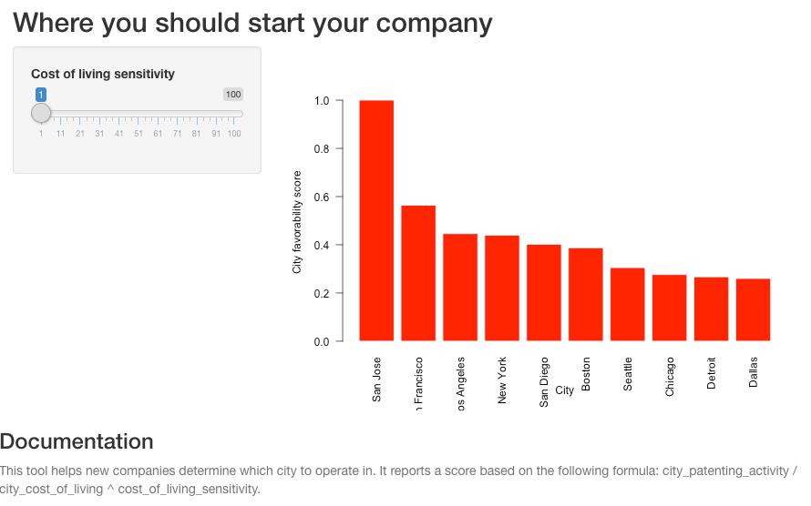

You should give me money
========================================================
- We are the world's premier budget-rate startup geoconsulting firm
- We will use our wb app platform to help you decide where to start your company, based on your self-reported price sensitivity
- You will pay us *handsomely* for this valuable advice

Rationale
========================================================

You need us bad

- You want to be near the action
- You want to conserve capital to enable growth
- You don't want to go on the census bureau website

Here is some of our juicy and informative data
========================================================

```{r, echo=FALSE}
    cost <- read.csv('cost-living.csv')
    pats <- read.csv('uspto-tidy.csv')
    coords <- read.csv('coords.csv')
    
    df <- merge(cost, pats,by="city", all=TRUE)
    df <- merge(df, coords,by="city", all=TRUE)
    df$comp <- df$patents / (df$cost) #Make composite score
    sorted <- df
    sorted <- df[order(df$comp, decreasing = TRUE),]
    sorted <- sorted[1:10,]
```
```{r, echo=TRUE}
    head(sorted)
    barplot(sorted$comp, border = 'white', names.arg = sorted$city, las=2, xlab = 'City', ylab = 'City favorability score')

```

This is what our product looks like - nice!
========================================================

```{r, echo=FALSE}

```


