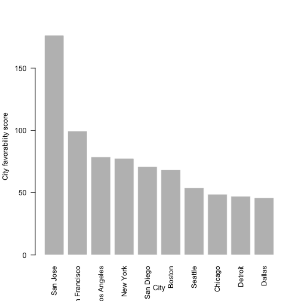
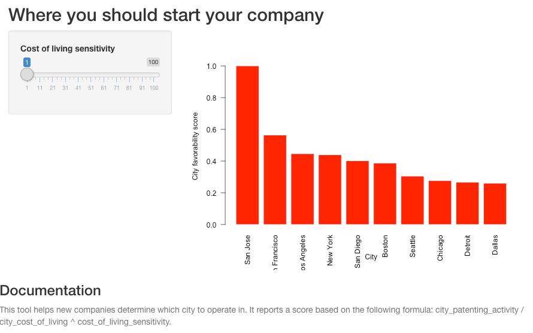

You should give me money
========================================================
author: Josh McNamara 
- We are the world's premier budget-rate startup geoconsulting firm
- We will use our wb app platform to help you decide where to start your company, based on your self-reported price sensitivity
- You will pay us *handsomely* for this valuable advice

Rationale
========================================================

You need us bad

- You want to be near the action
- You want to conserve capital to enable growth
- You don't want to go on the census bureau website

Here is some of our juicy and informative data
========================================================


```r
    head(sorted)
```

```
             city   cost patents      lat        lon      comp
242      San Jose  82.87   14618 37.33821 -121.88633 176.39677
241 San Francisco  97.84    9732 37.77493 -122.41942  99.46852
169   Los Angeles  82.30    6476 34.05223 -118.24368  78.68773
191      New York 100.00    7754 40.71278  -74.00594  77.54000
240     San Diego  77.01    5460 32.71574 -117.16108  70.89988
41         Boston  87.05    5949 42.36008  -71.05888  68.34003
```

```r
    barplot(sorted$comp, border = 'white', names.arg = sorted$city, las=2, xlab = 'City', ylab = 'City favorability score')
```



This is what our product looks like - nice!
========================================================


Step Three: Profit!
========================================================
Look at all this money!!!

-'$$$'
