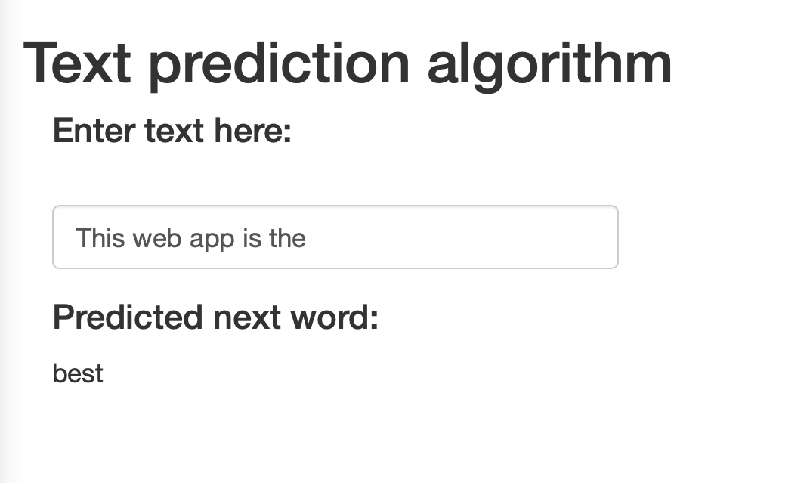

<style>
body {
    overflow: scroll;
}
</style>
Text prediction Shiny app
========================================================
author: Josh McNamara
date: 2019
autosize: true

Project for Coursera Data Science Capstone Project

Goal of the text prediction product
========================================================

- The goal is to deploy a web app that can predict the next word in a typed sequence.
- The project was split in three phases- development of a corpus for text mining, development of a prediction algorithm, deployment on a web server
- The application must make a reasonable word prediction within ~1 second for most typed sequences

Corpus construction
========================================================
- The corpus was constructed by combining 3% of the lines in each data set (Twitter, news, blogs)
- Various data cleaning schemes were applied, but the algorithm makes the most realistic predictions has minimally altered text. Contractions were expanded to their full forms. The RWeka word tokenizer was applied to extract tokens and exclude special characters.
- The prediction model predicts the last word in a trigram, so trigrams were extracted from the corpus and sorted by frequency. The 75,000 most frequent trigrams were kept to give reasonable breadth and keep the storage demands to less than a few Mb.
- Here is a sample of 3 lines from the corpus, and then a sample of 3 n-grams


```
[1] "Of all the issues of aging, the one that gets me the most is short term memory loss. People laugh about it but it's truly a curse."
[2] "Dear Omni Hotel or whoever is responsible for planning the menu: Vegetarians eat more than vegetables, and we need protein, too."  
[3] "they changed the potatoes for hashbrowns. they can't get the right food to the right person. Lot of untrained new staff"           
```

```
[1] "my life but"     "and being able"  "most about this"
```

Prediction model design
========================================================
* The prediction model follows a very simple decision tree:
    - grep for the last bigram entered in the first two positions in the bank of trigrams and return the third element of the trigram with the highest frequency in the corpora
    - Otherwise, return the most common English word: 'the'.


```r
predict <- function(inp, n_grams){
        # Make input the last two words
        inp <- WordTokenizer(inp) # Clean the input
        inp <- inp[(length(inp)-1):length(inp)] # Select the last two words from the input
        
        # Return 3rd elemnt of matching trigrams
        inp <- paste('^', inp[1], ' ', inp[2], ' ', sep='') # Convert tokenized input to string
        out <- grep(x=corpora, pattern=inp, value = TRUE) # Search the trigram bank for the last two typed words
        
        # Return function
        if (length(out)) {
                out <- out[1] # Select most frequent trigram
                out <- WordTokenizer(out)[3] # Output third element of chosen trigram
        }
        else {
           return('the')     # If there is no prediction for the phrase, output the most common English word.
        }
}
```

Shiny App Data Product
========================================================
- The application can be accessed here:
https://mcnamara.shinyapps.io/autocomplete_shiny_app/
- It looks like this:





